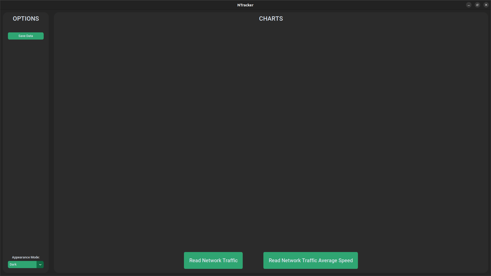
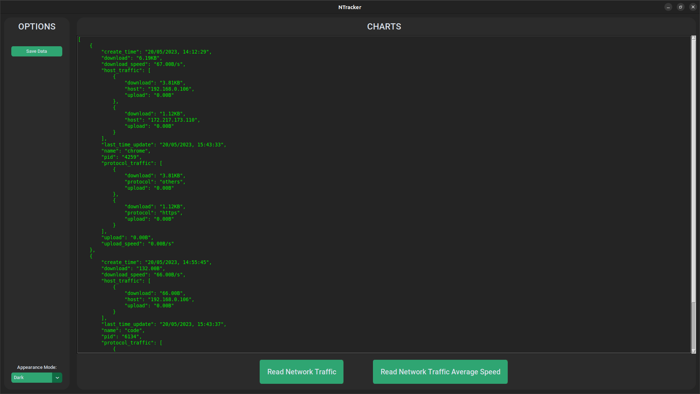
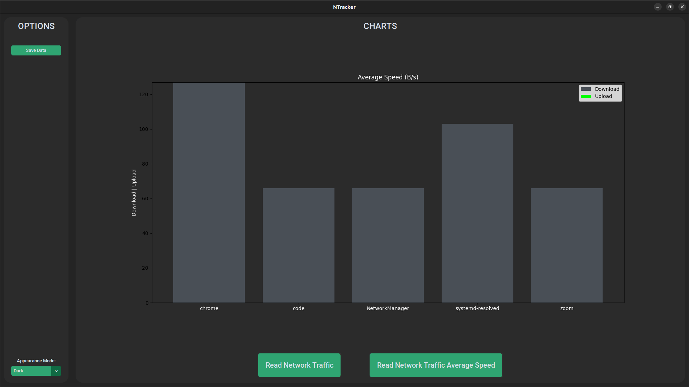

# README - Backend


## Summary :clipboard:

* [Requirements](#requirements)
* [Setup and Installation](#setup-installation)
* [How to Use](#how-to-use)
* [Final Considerations](#final-considerations)

*********************
##  Requirements :pencil: <a name="requirements"></a>

* [Python 3.10+](https://www.python.org/)
* Pip 23.1+ (comes with Python 3)

*********************
##  Setup and Installation :white_check_mark: <a name="setup-installation"></a>

### Cloning the repo :file_folder:
First off, in order to get a copy of the project in order to run/test it, clone the repository into a folder on your machine:

```
git clone git@github.com:jvoliveirag/Hackathon-Inatel-2023.git
```

### Creating and Activating the Virtual Environment :open_file_folder:
It is recommended to install the dependencies inside a [virtualenv](https://docs.python.org/3/tutorial/venv.html). So, inside the folder where you cloned the repository, create a new virtualenv:

```
python3 -m virtualenv venv
```

If you don't have the virtualenv package installed, you can install it with pip:

```
pip install virtualenv
```
    
Now, activate the virtualenv (for Linux/MacOS):

```
source venv/bin/activate
```

or (for Windows):

```
.\venv\Scripts\activate
```

### Installing Dependencies :wrench:
To install all the necessary project dependencies, run the following command in the terminal (make sure you're running it from whithin your virtualenv):

```
pip install -r requirements.txt
```

### Creating the .env file :spiral_notepad:
In order to run the project, you must create a .env file to store the necessary environment variables (in this case, the UI injection).
To do so, open the file named ".env.tmpl" and follow the instructions inside it to create the .env file.

### Executing the Project :arrow_forward:
To run your project, go to `src` folder (`cd app/src`) and run the following command in the terminal (make sure you're running it from whithin your virtualenv):

```
python -m main
```

Alternatively, you can run the project from the root folder using the Makefile:

```
make run
```

*********************

## How To Use :man_technologist: <a name="how-to-use"></a>

If you chose to run the project using the desktop UI (by setting the UI variable to "Tkinter" in the .env file), you will be presented with the following screen:



In this screen, you can choose the desired action by clicking on the corresponding button. The actions are:

* Read Network Traffic: Read your network traffic data and display it in the screen. The output will be like so:



* Read Network Traffic Average Speed: Read your network traffic data and display the average speed in the screen by using charts. The output will be like so:



After reading that and getting the chart in your screen, you can choose to save the chart as an image by clicking on the "Save Data" button.

If you chose to run the project using the web UI (by setting the UI variable to "Flask" in the .env file), you will have your Flask application running on your localhost. To access it, open your browser and go to the `127.0.0.1:5000` address.

To access the same data as the desktop UI, you can go to the following endpoints:

* `/network-traffic-data`: Read your network traffic data and return it in a json format.

* `/network-traffic-average-speed`: Read your network traffic for a some amount of time and retunr the json data including the average download and upload speeds.


*********************

## Final Considerations :pushpin: <a name="final-considerations"></a>

Unfortunately, the project is not able to run from within a Docker container. This is because the project uses the `scapy` library to read the network traffic data, and this library is not able to run from within a Docker container.

Also, due to the short amount of time to develop the project, the code is not as clean as it could be. There are some parts that could be refactored and some parts that could be better documented.