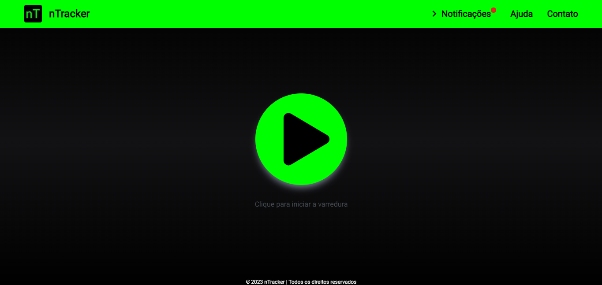
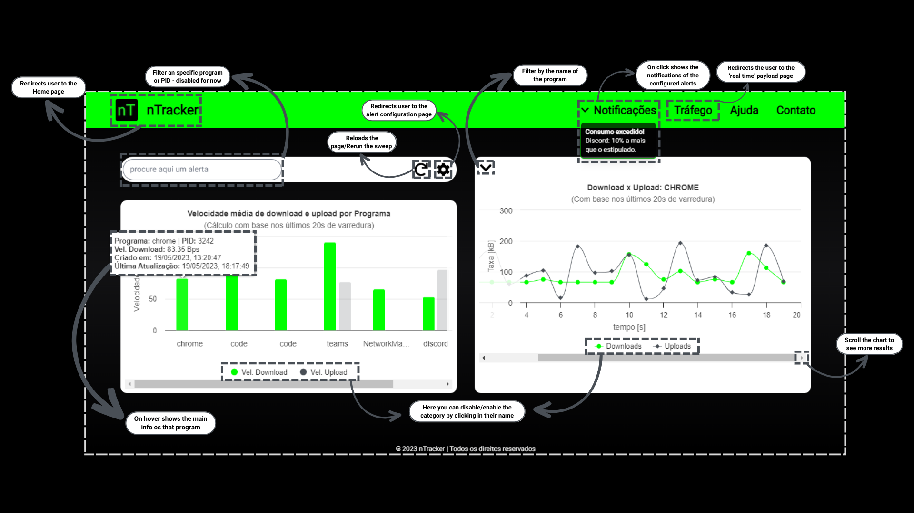

# README - Frontend

## Summary :clipboard:

- [Requirements](#requirements)
- [Setup and Installation](#setup-installation)
- [How to Use](#how-to-use)
- [Final Considerations](#final-considerations)

---

## Requirements :pencil: <a name="requirements"></a>

- [TypeScript 4.8+](https://www.typescriptlang.org/)
- Npm 9.5.1+

---

## Setup and Installation :white_check_mark: <a name="setup-installation"></a>

### Cloning the repo :file_folder:

First off, in order to get a copy of the project and be able to run/test it, clone the repository into a folder on your machine:

```
git clone git@github.com:jvoliveirag/Hackathon-Inatel-2023.git
```

### Installing Dependencies :wrench:

First access the frontend directory:

```
cd frontend
```

Now, to install all the necessary project dependencies, run the following command in the terminal:

```
npm install
```

### Executing the Project :arrow_forward:

To run your project, simply type the following command in the terminal (make sure you are running it from within the frontend folder):

```
npm run dev
```

---

## How To Use :man_technologist: <a name="how-to-use"></a>

There are two possible ways to run the app. One is the desktop version and other is the web version, which will be explained here.

<b><u>Obs.:</u></b> If you chose to run the project using the desktop UI (by setting the UI variable to "Tkinter" in the .env file), plese refer to the <a href='https://github.com/jvoliveirag/Hackathon-Inatel-2023/blob/main/backend/README.md'>Backend</a> docs to see more.

For the web version, you will need to set the UI variable to "Flask" in the .env file in the backend directory (feel free to read the backend docs as well). Then you will be ready to go!

So, now you have your web version configured you need to open <i><u>localhost</u></i> in your browser to see to application running. You must receive a message like this in your terminal:

`ready - started server on 0.0.0.0:3000, url: http://localhost:3000`

Now if you go to the browser window this is what you should see:



Just click the 'Start' Button on the center to see the results. The following image explains the details of the `report` page.



## Final Considerations :pushpin: <a name="final-considerations"></a>

Unfortunately, the project is not able to run from within a Docker container. This is because the project uses the `scapy` library to read the network traffic data, and this library is not able to run from within a Docker container.

Also, due to the short amount of time to develop the project, the code is not as clean as it could be. There are some parts that could be refactored and some parts that could be better documented.

Although we faced some issues during the development, we could learn a lot from this and we are happy with the results. We are excited to keep working on new features and refactors to improve the app and make the project even better.
